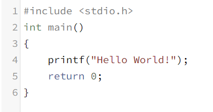
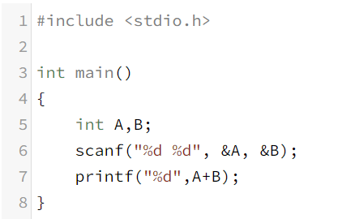
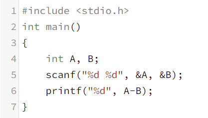
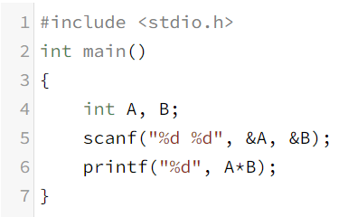
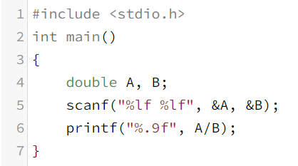

#**1-Day**
>* Hello World 출력

>⤷ C 언어 기초 개념
* 전처리 지시자 #include <stdio.h> - python에서 import.함수 했던 것과 같은 역할을 함.
* int main() - main은 함수의 이름. 이 안의 프로그램은 꼭 정수(int)로 나오는 프로그램이 아니어도 됨. 정수로 나오는 프로그램이 아니어도 자동으로 return 0; 이 되는 함수.
* stdio.h - printf(), scanf() 를 사용 가능하게 해주는 함수(?) 임. stdio.h가 아닌 다른 것을 쓰는 경우 printf 와 scanf는 못 쓰게 됨.
* {} - python에서는 int(n) 이런식으로 ()안에 식, 함수 등을 썼다면 C 언어 에서는 {}안에 씀.
* ; - 마침표 같은 역할. 한 줄이 끝날 때 마다 ;을 붙여줘야 함. 그러지 않으면 오류 뜸.

>* A + B 계산

>⤷ C 언어 기초 개념
* int A, B; - A, B 가 정수라고 지정
* scanf() - python의 input()과 비슷한 역할을 해줌.
* %d - 해당 자료형을 정수형으로 저장.
* "%d", A + B - A + B의 결과 값을 %d에 넣어줌.
* & - 문자 앞에 &은 꼭 써줘야 함.
  
>* A - B 계산

>⤷ C 언어 기초 개념
* (A - B) - 사칙연산 기호는 python과 동일. 

>* A * B 계산

>* A / B 계산

>⤷ C 언어 기초 개념
* double - float에서 쓸 수 있는 소수점 아래 자릿수를 2배로 만들어 줌.
* %lf - 해당 자료형을 그냥 float 보다 더 긴 float로 저장.
* %.nf - 소수 n 번째 자리수 까지 나타내라는 명령어.

>+) C 언어 기초 개념
* // - python에서 #과 같은 주석 역할을 함. ( 주석 - 프로그램이 실행될 때 포함 되지 않음. )