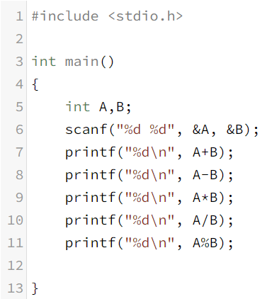
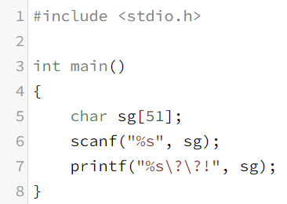
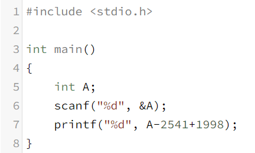
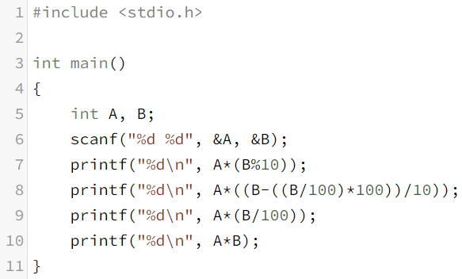
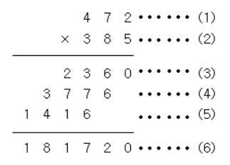
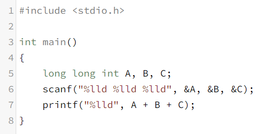
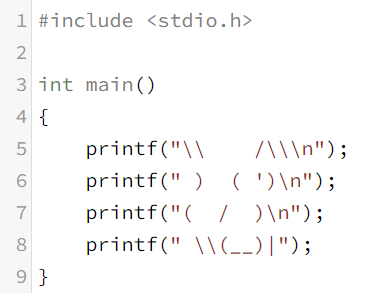
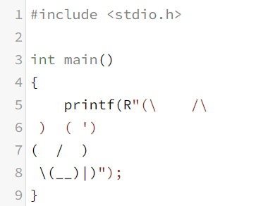
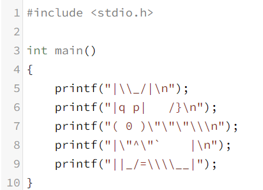

#**2-Day**
> C 언어 기초 개념
* \ - $ 같이 원 기호를 눌러주면 됨.
* \n - 줄 바꿈 기호. C 언어 는  python 과 달리 엔터로 줄 바꿈을 해서 프로그램을 짜도 일자로 출력을 하기 때문에 따로 줄 바꿈 기호를 써줘야 함.
* \b - 한 칸 앞으로 이동.
* \r - \r 줄의 시작으로 이동.
* \a - 경고음 출력(삐삐--).
* char - int 와 같이 자료형을 나타내어 주는 기호로 문자를 표현. (character의 약자)

>* 사칙연산

> ⤷ C 언어 기초 개념
*  % - 나눈 나머지를 출력. python과 동일.

>* 동일한 아이디 ??!

>⤷ C 언어 기초 개념
* char sg[n] - n이 있는 자리에 숫자를 넣어 주는 데 그 수만큼의 자릿수가 들어 갈 수 있음. 조건처럼 사용. <python : len() > n+1>
* %s - s는 sting의 약자로 해당 자료형을 문자형으로 저장. 문자는 숫자와 다르게 &sg가 아닌 그냥 sg로 적음. 
* \ - ?는 문자 ?만이 아닌 다양한 역할을 하는데 이떄 ?를 문자로 쓰고 싶다면 앞에 \을 붙여 문자로 사용할 것임을 알려줌.

>* 서기계산

>⤷ C 언어 기초 개념
* A-2541... - 컴마 뒤 문자를 써넣고 계산식을 적으면 계산이 가능함.

>* 여러 계산 법

>⤷ C 언어 기초 개념
* \n - 줄 바꿈 기호는 %d 뒤에 써줌.
* () - 원래 계산하는 것 처럼 ()안에 있는 식을 먼저 계산.

>* 자리수별로 곱셈

>⤷ 설명

* printf 1번째 줄 - A와 B의 일의 자리 숫자와의 곱셈. (3) 표현
* printf 2번째 줄 - A와 B의 십의 자리 숫자와의 곱셈. (4) 표현
* printf 3번째 줄 - A와 B의 백의 자리 숫자와의 곱셈. (5) 표현
* printf 4번째 줄 - A와 B의 곱셈. (6) 표현

>* 큰 자리수 세 정수의 합

>⤷ C 언어 기초 개념
* long long int - 입력되는 숫자가 int로는 입력받지 못 할만큼 클떄 long을 붙여 입력받을 수 있는 int의 용량을 늘려줌. long을 붙여 줄 때마다 4byte 만큼 더 길게 써줄 수 있음. (int가 받을 수 있는 용량의 최대치는 32bit(4byte)이다. - 2147483647)
* %lld - long을 붙여준 만큼 l을 더 붙여주면 됨. ( if | long int -> %ld )

>* 고양이 만들기 ver.1

↕ 둘의 출력값은 같음.

>* 고양이 만들기 ver.2

>⤷ C 언어 기초 개념
* printf(R"(...)"); - 이런 식으로 써주면 ver.1 과 같이 하나하나 printf() 사용하지 않아도 됨.

>* 강아지 만들기

>⤷ C 언어 기초 개념
* printf(R"(...)"); 을 사용할 때 R을 구분지어 주는 것 중 하나가 "인데 강아지에는 "가 많이 들어 있어 \을 하나하나마다 다 붙여줘야 함으로 printf(R"(...)"); 을 사용하기 힘듦.

>+) C 언어 기초 개념
* %c - 입력하고 싶은 문자가 하나일 때만 사용. [ex)scanf("%c" , A)]
* C 언어 에서는 숫자나 문자의 저장을 아스키 코드 숫자로 저장함.